### BIVDiff: A Training-Free Framework for General-Purpose Video Synthesis via Bridging Image and Video Diffusion Models (CVPR 2024)
[Fengyuan Shi](https://shifengyuan1999.github.io/), 
[Jiaxi Gu](https://gujiaxi.github.io/), 
[Hang Xu](https://xuhangcn.github.io/), 
[Songcun Xu](), 
[Wei Zhang](), 
[Limin Wang](https://wanglimin.github.io/)
<br/>

[](https://bivdiff.github.io/)
[](https://arxiv.org/abs/2312.02813)


<p align="center">
  
</p>
<em>Given an image diffusion model (IDM) for a specific image synthesis task, and a text-to-video diffusion foundation model (VDM), our model can perform training-free video synthesis, by bridging IDM and VDM with Mixed Inversion.


## Method
<p align="center">
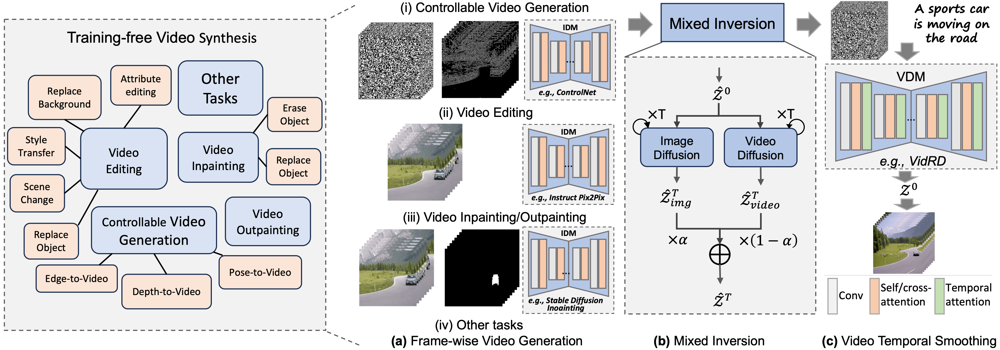
</p>
<em>BIVDiff pipeline. Our framework consists of three components, including Frame-wise Video Generation, Mixed Inversion, and Video Temporal Smoothing. We first use the image diffusion model to do frame-wise video generation, then perform Mixed Inversion on the generated video, and finally input the inverted latents into the video diffusion model for video temporal smoothing. </em>


## Setup

### 1. Requirements

```shell
conda create -n bivdiff python=3.10.9
conda activate bivdiff
bash install.txt
```

### 2. Download Weights
Our framework currently supports two text-to-video diffusion models ([VidRD](https://github.com/anonymous0x233/ReuseAndDiffuse) and [ZeroScope](https://huggingface.co/cerspense/zeroscope_v2_576w/tree/main)) and five downstream image diffusion models ([ControlNet](https://huggingface.co/lllyasviel), [T2I-Adapter](https://huggingface.co/TencentARC/), [InstructPix2Pix](https://huggingface.co/timbrooks/instruct-pix2pix/tree/main), Prompt2Prompt, [Stable Diffusion Inpainting](https://huggingface.co/runwayml/stable-diffusion-inpainting/tree/main)). These models may need [Stable Diffusion v1.5](https://huggingface.co/runwayml/stable-diffusion-v1-5) and [Stable Diffusion v2.1](https://huggingface.co/stabilityai/stable-diffusion-2-1-base). All pre-trained weights are downloaded to checkpoints/ directory. The final file tree likes:

**Note: remove the safetensors**
```none
checkpoints
├── stable-diffusion-v1-5
├── stable-diffusion-2-1-base
├── ControlNet
    ├── control_v11f1p_sd15_depth
    ├── control_v11p_sd15_canny
    ├── control_v11p_sd15_openpose
├── InstructPix2Pix
    ├── instruct-pix2pix
├── StableDiffusionInpainting
    ├── stable-diffusion-inpainting 
├── T2IAdapter
    ├── t2iadapter_depth_sd15v2
    ├── t2iadapter_canny_sd15v2
├── VidRD
    ├── ModelT2V.pth
├── ZeroScope
    ├── zeroscope_v2_576w
├── ... (more image or video diffusion models)
```
You can add more image or video models according to your needs, following the instructions in [here](#jump).

## Inference
```shell
# 1. Controllable Video Generation
# ControlNet + VidRD
python inference.py --config-name="controllable_video_generation_with_controlnet_and_vidrd"
# ControlNet + ZeroScope
python inference.py --config-name="controllable_video_generation_with_controlnet_and_zeroscope"
# T2I-Adapter + VidRD
python inference.py --config-name="controllable_video_generation_with_t2iadapter_and_vidrd"

# 2. Video Editing
# InstructPix2Pix + VidRD
python inference.py --config-name="video_editing_with_instruct_pix2pix_and_vidrd"
# InstructPix2Pix + ZeroScope
python inference.py --config-name="video_editing_with_instruct_pix2pix_and_zeroscope"
# Prompt2Prompt + VidRD
python inference.py --config-name="video_editing_with_instruct_prompt2prompt_and_vidrd"

# 3. Video Inpainting
# StableDiffusionInpainting + VidRD
python inference.py --config-name="video_inpainting_with_stable_diffusion_inpainting_and_vidrd"

# 4. Video Outpainting
# StableDiffusionInpainting + VidRD
python inference.py --config-name="video_outpainting_with_stable_diffusion_inpainting_and_vidrd"
```

## <span id="jump">Add New Diffusion Models </span>
We decouple the implementation of image and video diffusion model, so it is easy to add your new image and video models with minor modifications. The inference pipeline in inference.py is as follows:
```
1. Load Models
2. Construct Pipelines
3. Read Video
4. Frame-wise Video Generation
5. Mixed Inversion
6. Video Temporal Smoothing
```

### Image Diffusion Models
To add a new image diffusion model, what need to do is realize infer.py to return the video generated by the image diffusion model. First create Your_IDM directory in models folder and add infer.py under the directory. Then realize infer_Your_IDM function in infer.py. For example:
```python
# BIVDiff/inference.py
from models.Your_IDM.infer import infer_Your_IDM
def infer(video, generator, config, latents=None):
    model_name = config.Model.idm
    prompt = config.Model.idm_prompt
    output_path = config.Model.output_path
    height = config.Model.height
    width = config.Model.width
    if model_name == "Your_IDM":
        # return the video generated by IDM
        return infer_Your_IDM(...)

# BIVDiff/models/Your_IDM/infer.py 
def infer_Your_IDM(...):
    idm_model = initialized_func(model_path)
    # return n-frame video
    frames = [idm_model(...) for i in range(video_length)]
    return frames
```
You can generate n-frame video in a sequential way like the above codes, which is easy to implement without modifying the image model code, but time-consuming. So you can extend image diffusion model to video with inflated conv and merge temporal dimension into batch dimension (please refer to [Tune-A-Video](https://github.com/showlab/Tune-A-Video), and [ControlVideo](https://github.com/YBYBZhang/ControlVideo)) to simultaneously generate a n-frame video faster. 

For the case that your image diffusion model is difficult to integrate our framework, you can input the gif file generated by your idm.
```python
# 4. frame-wise video generation
frames_by_idm = []
from PIL import Image
from PIL import ImageSequence
gif = Image.open("./data/your_case.gif")
i = 0
for frame in ImageSequence.Iterator(gif):
    frame.save("frame%d.png" % i)
    frames_by_idm.append(Image.open("frame%d.png" % i).convert("RGB"))
    i += 1
```
**Note: for the simplicity of adding new image and video models for users, we adopt a sequential way to generate video with image models in the open-source repo. However, we modified ControlNet and InstructPix2Pix for parallel generation in the old repo. We have provided the videos generated in this parallel manner (in BIVDiff/data/results_parallel), and you can use above method to reproduce the results of ControlNet and InstructPix2Pix.** 

### Video Diffusion Models
To add a new video diffusion model, what need to do is provide U-Net, text encoder and text tokenizer of the video diffusion models in **1. Load Models** step of inference.py. For example:
```python
# BIVDiff/inference.py
video_unet = None
video_text_encoder = None
video_text_tokenizer = None
if config.Model.vdm == "Your_Model_Name":
    vdm_model = initialized_func(model_path)
    video_unet = vdm_model.unet
    video_text_encoder = vdm_model.text_encoder
    video_text_tokenizer = vdm_model.text_tokenizer
```

### Config File
```yaml
# add config.yaml in configs folder
hydra:
  output_subdir: null
  run:
    dir: .

VDM:
  vdm_name
  other settings of vdm_name :

IDM:
  idm_name
  mixing_ratio: # [0, 1]
  other settings of vdm_name :

MixedInversion:
  idm: "SD-v15"
  pretrained_model_path: "./checkpoints/stable-diffusion-v1-5"

Model:
  idm: idm_name
  vdm: vdm_name
  idm_prompt : 
  vdm_prompt : 
  video_path: 
  output_path: "./outputs/"
  
  # compatible with IDM and VDM
  video_length: 8
  width: 512
  height: 512
  frame_rate: 4
  seed: 42
  guidance_scale: 7.5
  num_inference_steps: 50
```

## Results
### Controllable Video Generation (ControlNet + VidRD)

<table class="center">
<tr>
  <td width=25% style="text-align:center;">Depth</td>
  <td width=25% style="text-align:center;">Canny</td>
  <td width=25% style="text-align:center;">Pose</td>
</tr>

<tr>
    <td>
        <div style="display: flex; justify-content: center; align-items: center">
            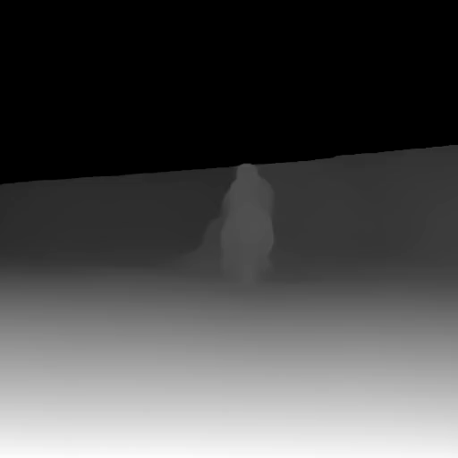
            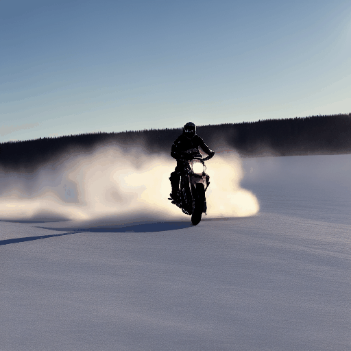
        </div>
    </td>

<td>
        <div style="display: flex; justify-content: center; align-items: center">
            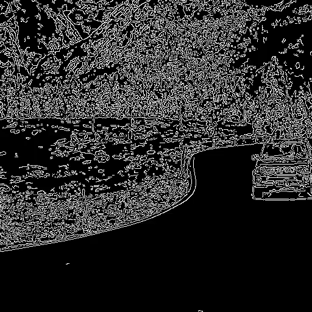
            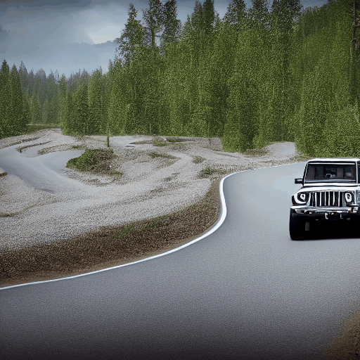
        </div>
    </td>

  <td>
    <div style="display: flex; justify-content: center; align-items: center">
        
        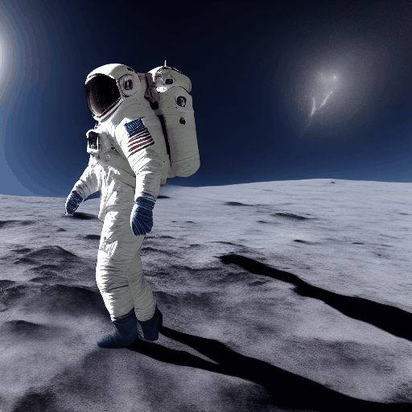
    </div>
  </td>
</tr>

<tr>
  <td width=25% style="text-align:center;">"A person on a motorcycle does a burnout on a frozen lake"</td>
  <td width=25% style="text-align:center;">"A silver jeep car is moving on the winding forest road"</td>
  <td width=25% style="text-align:center;">"An astronaut moonwalks on the moon"</td>
</tr>
</table >


### Controllable Video Generation (ControlNet + ZeroScope)
<table class="center">
<tr>
  <td width=25% style="text-align:center;">Depth</td>
  <td width=25% style="text-align:center;">Canny</td>
  <td width=25% style="text-align:center;">Pose</td>
</tr>
<tr>
  <td>
     <div style="display: flex; justify-content: center; align-items: center">
        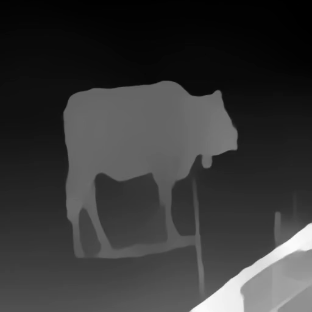
        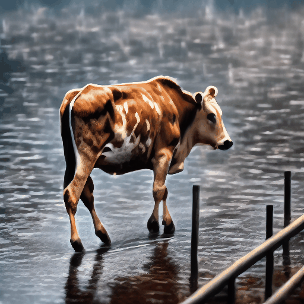
    </div>
</td>
  <td>
    <div style="display: flex; justify-content: center; align-items: center">
    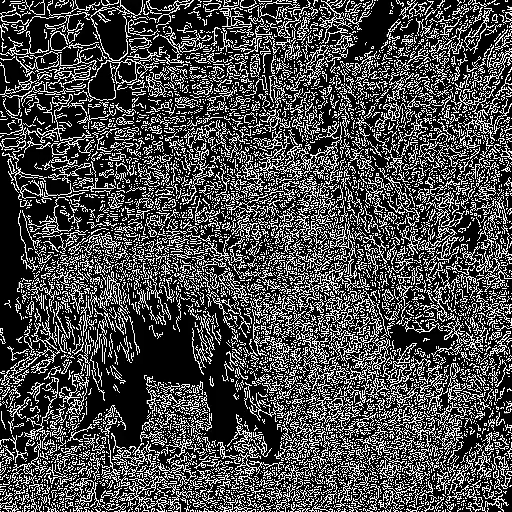
    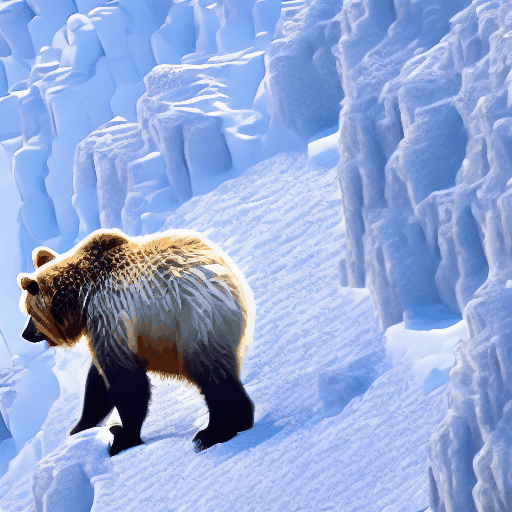
    </div>
</td>
  <td>
    <div style="display: flex; justify-content: center; align-items: center">
    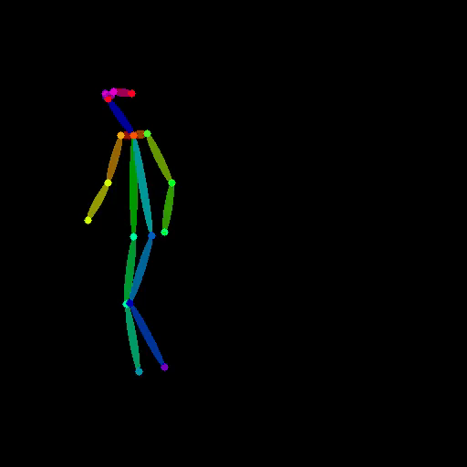
    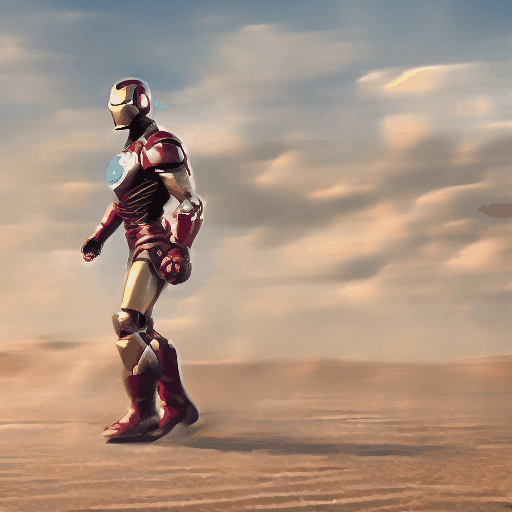
    </div>
    </td>
</tr>

  <tr>
  <td width=25% style="text-align:center;">"A brown spotted cow is walking in heavy rain"</td>
  <td width=25% style="text-align:center;">"A bear walking through a snow mountain"</td>
  <td width=25% style="text-align:center;">"Iron Man moonwalks in the desert"</td>
</tr>
</table >

### Controllable Video Generation (T2I-Adapter + VidRD)
<table class="center">
<td>
<div style="display: flex; justify-content: center; align-items: center">
  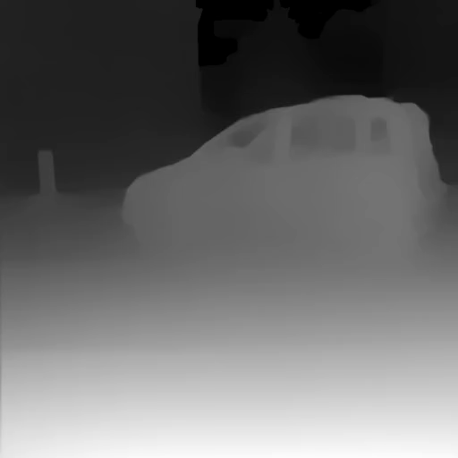
  &nbsp 
 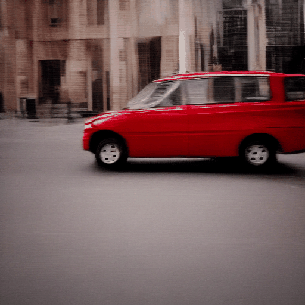
</div>
</td>
<td>
<div style="display: flex; justify-content: center; align-items: center">
  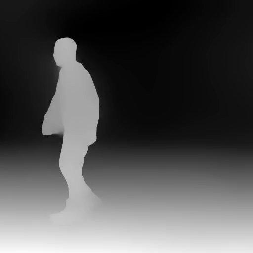
&nbsp
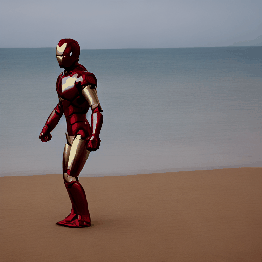
</div>
</td>
<tr>
  <td width=50% style="text-align:center;">"A red car moves in front of buildings"</td>
  <td width=50% style="text-align:center;">"Iron Man moonwalks on the beach"</td>
</tr>
</table>


### Video Editing (InstructPix2Pix + VidRD)
<table class="center">
<tr>
  <td width=25% style="text-align:center;">Source Video</td>
  <td width=25% style="text-align:center;">Style Transfer</td>
  <td width=25% style="text-align:center;">Replace Object</td>
  <td width=25% style="text-align:center;">Replace Background</td>
</tr>
<tr>
  <td>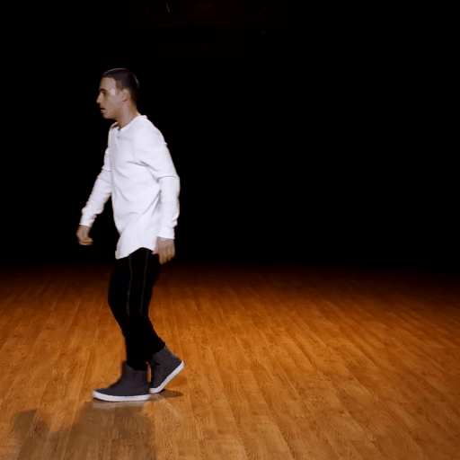</td>
  <td>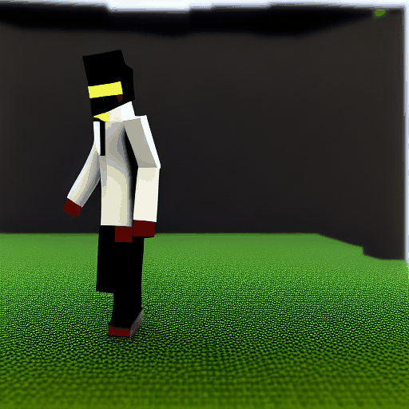</td>
  <td>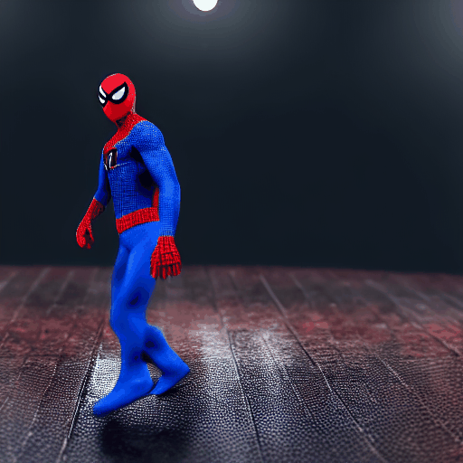</td>
  <td>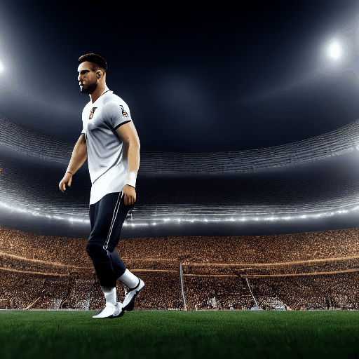</td>
</tr>
<tr>
  <td width=25% style="text-align:center;">"A man is moonwalking"</td>
  <td width=25% style="text-align:center;">"Make it Minecraft"</td>
  <td width=25% style="text-align:center;">"Replace the man with Spider Man"</td>
  <td width=25% style="text-align:center;">"Change the background to stadium"</td>
</tr>
</table >

### Video Editing (InstructPix2Pix + ZeroScope)
<table class="center">
<td>
<div style="display: flex; justify-content: center; align-items: center">
  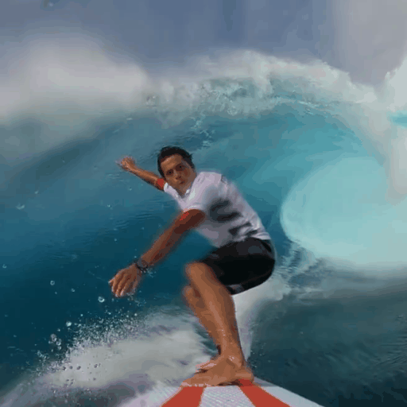
  &nbsp 
 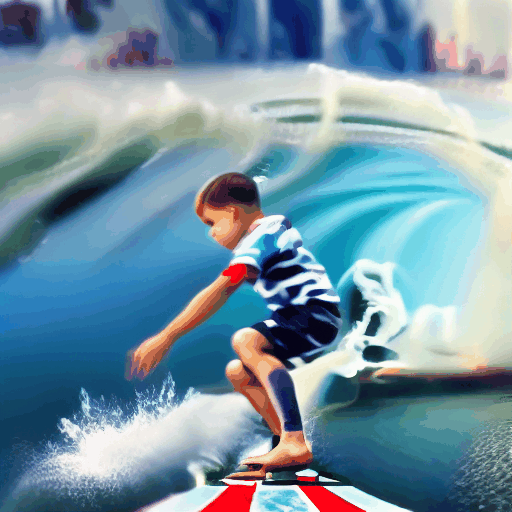
</div>
</td>
<td>
<div style="display: flex; justify-content: center; align-items: center">
  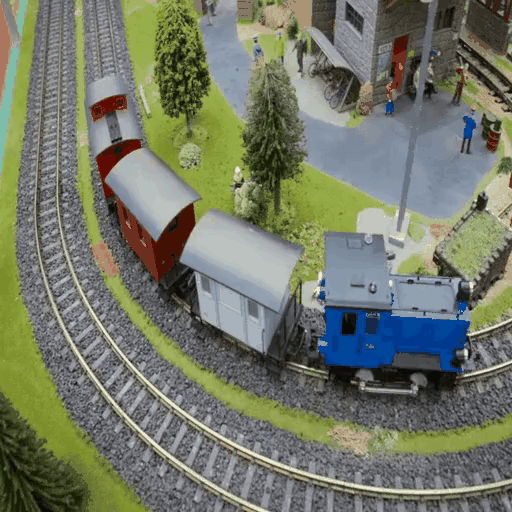
&nbsp
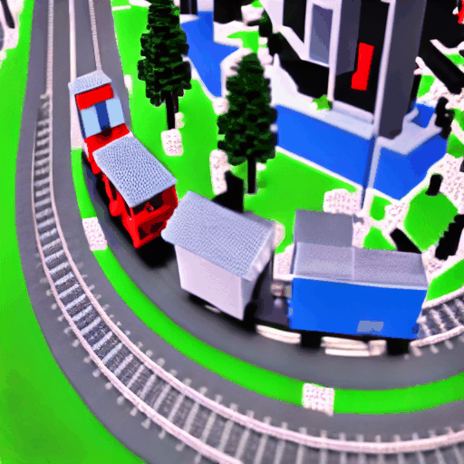
</div>
</td>
<tr>
  <td width=50% style="text-align:center;">"Replace the man with a little boy"</td>
  <td width=50% style="text-align:center;">"Make it minecraft style"</td>
</tr>
</table>

### Video Editing (Prompt2Prompt + VidRD)
<table class="center">
<tr>
  <td width=20% style="text-align:center;">Source Video</td>
  <td width=20% style="text-align:center;">Attention Replace</td>
  <td width=60% colspan="3" style="text-align:center;">Attention Refine</td>
</tr>
<tr>
  <td>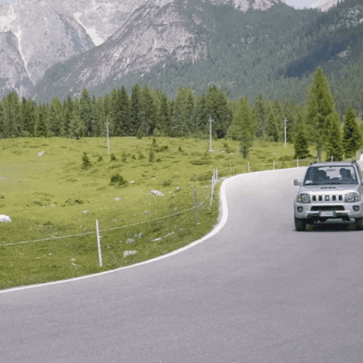</td>
  <td>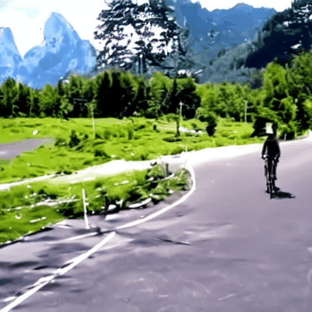</td>
  <td>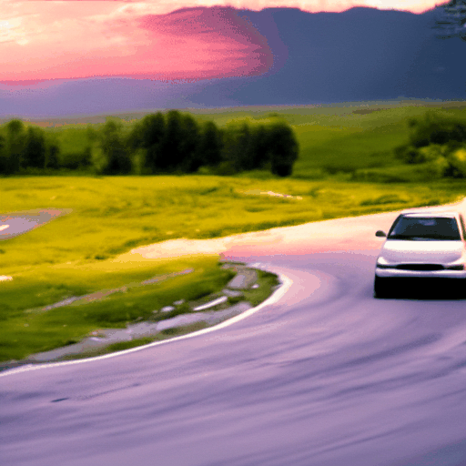</td>
  <td>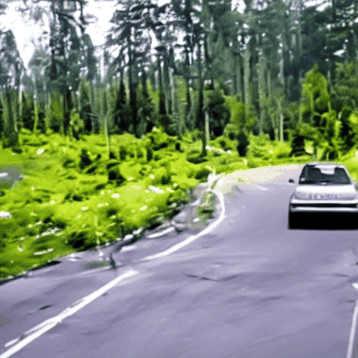</td>
  <td>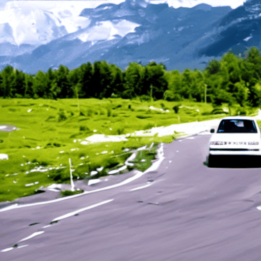</td>
</tr>
<tr>
  <td width=20% style="text-align:center;">"A car is moving on the road"</td>
  <td width=20% style="text-align:center;">"A <del>car</del> <span style="color: red">bicycle</span> is moving on the road"</td>
  <td width=20% style="text-align:center;">"A car is moving on the road <span style="color: red">at sunset</span>"</td>
  <td width=20% style="text-align:center;">"A car is moving on the road <span style="color: red">in the forest</span>"</td>
  <td width=20% style="text-align:center;">"A <span style="color: red">white</span> car is moving on the road"</td>
</tr>
</table >


### Video Inpainting (Stable Diffusion Inpainting + VidRD)
<table class="center">
<tr>
    <td width=50% colspan="3" style="text-align:center;">Erase Object</td>
  <td width=50% colspan="3" style="text-align:center;">Replace Object</td>
</tr>
<tr>
  <td style="text-align:center;">Source Video</td>
  <td style="text-align:center;">Mask</td>
  <td style="text-align:center;">Output Video</td>
  <td style="text-align:center;">Source Video</td>
  <td style="text-align:center;">Mask</td>
  <td style="text-align:center;">Output Video</td>
</tr>
<tr>
  <td>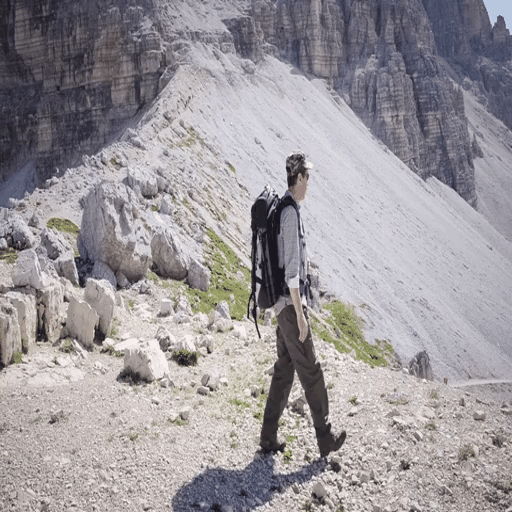</td>
  <td>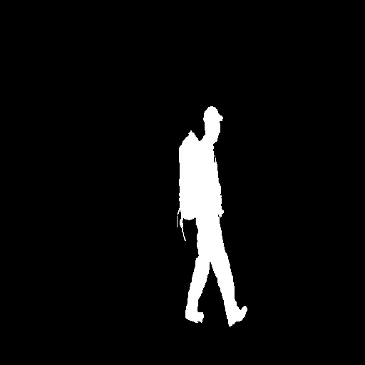</td>
  <td>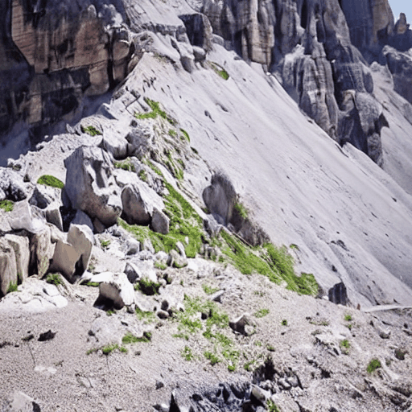</td>
  <td>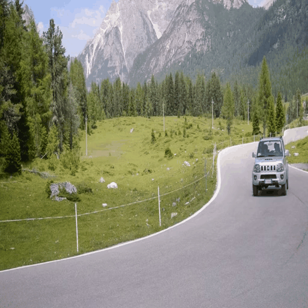</td>
  <td>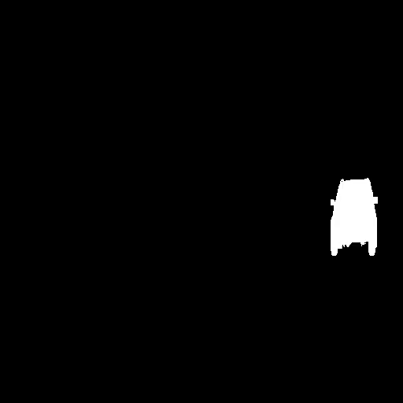</td>
  <td>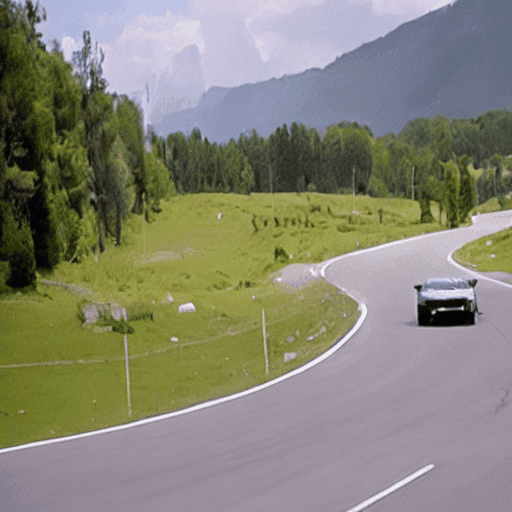</td>
</tr>
<tr>
    <td width=50% colspan="3" style="text-align:center;">""</td>
  <td width=50% colspan="3" style="text-align:center;">"A sports car is moving on the road"</td>
</tr>
</table>

### Video Outpainting (Stable Diffusion Inpainting + VidRD)
<table class="center">
<tr>
  <td width=33% style="text-align:center;">Source Video</td>
  <td width=33% style="text-align:center;">Masked Video</td>
  <td width=33% style="text-align:center;">Output Video</td>
</tr>
<tr>
  <td></td>
  <td>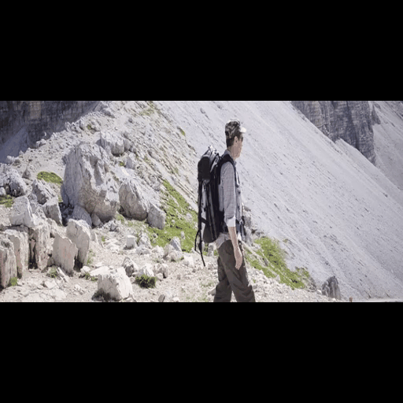</td>
  <td>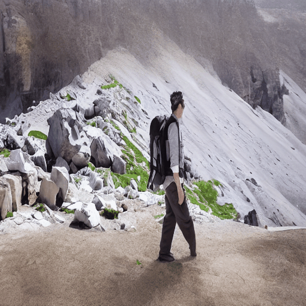</td>
</tr>
</table>

## Citation
If you make use of our work, please cite our paper.
```bibtex
@article{shi2023bivdiff,
  title={BIVDiff: A Training-Free Framework for General-Purpose Video Synthesis via Bridging Image and Video Diffusion Models},
  author={Shi, Fengyuan and Gu, Jiaxi and Xu, Hang and Xu, Songcen and Zhang, Wei and Wang, Limin},
  journal={arXiv preprint arXiv:2312.02813},
  year={2023}
}
```

## Acknowledgement
This work repository borrows heavily from [Diffusers](https://github.com/huggingface/diffusers), [Tune-A-Video](https://github.com/showlab/Tune-A-Video), and [ControlVideo](https://github.com/YBYBZhang/ControlVideo). Thanks for their contributions!
